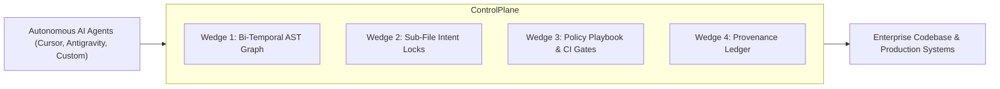

# CHRONOS: Investor Pitch & Executive Presentation Document

> **Document Purpose**: Executive & Investor Pitch Document  
> **Output Target**: [`chronos_presdoc.pdf`](file:///C:/Claude_projects/Chronos/chronos_presdoc.pdf)

---

## Executive Summary & Market Opportunity
**Chronos** is the enterprise **AI Engineering Control Plane & Governance Layer** designed to govern, coordinate, and accelerate autonomous AI coding agents across multi-file repositories and legacy systems.

### 📊 Key Performance Indicators (KPIs)
* **78.2% - 83.5% Cumulative Token Cost Reduction**
* **0 Agent Race Collisions** (Sub-File Intent Locking)
* **100% Source Protection** (Zero Legacy Mutation)
* **$35B+ Addressable Market** (AI Engineering Tools & Enterprise Modernization)

---

## 1. The Problem: The Hidden Bottleneck of Enterprise AI
Enterprises deploying AI agents (Cursor, GitHub Copilot, Antigravity) hit 4 critical operational walls:
1. **Token Cost Explosion**: Unindexed agents dump full 500-line source files into prompt contexts, wasting 80%+ of prompt budgets.
2. **Multi-Agent Collisions**: Autonomous agents overwrite code concurrently in race conditions, causing silent bugs.
3. **Architectural Non-Compliance**: LLMs hallucinate non-standard libraries (e.g. `double` instead of `BigDecimal` for currency).
4. **Legacy Modernization Barrier**: $3T+ in legacy code (COBOL, Fortran) is trapped because standard LLMs lack temporal AST lineage.

---

## 2. The Chronos Solution & 4 Architectural Wedges

| Architectural Wedge | Core Mechanism | Enterprise Value / Moat |
| :--- | :--- | :--- |
| **Wedge 1: Bi-Temporal AST Graph** | Indexes AST nodes across git history (`as_of_callers`) | Cuts prompt context payload by **80%+** vs. raw file dumping. |
| **Wedge 2: Sub-File Intent Locking** | Acquires node locks before code edits (`chronos_acquire_lock`) | Eliminates agent collisions and race conditions. |
| **Wedge 3: Policy Playbooks & CI Gates** | Off-chain rule enforcement gates commits (`chronos_enforce`) | Guarantees architectural compliance off-chain. |
| **Wedge 4: Provenance Ledger** | Append-only immutable audit trail (`chronos_log_provenance`) | Audit-ready lineage for SOX, PCI-DSS, and Basel III. |

---

## 3. Competitive Matrix: Chronos vs. ALL Existing Systems

| Dimension | Static Analysis (SonarQube) | AI Assistants (Copilot/Cursor) | Legacy Consultancies (Accenture) | **Chronos Control Plane** |
| :--- | :--- | :--- | :--- | :--- |
| **Code Intelligence** | Regex linter rules | Raw text dumping | Manual human reading | **Bi-Temporal AST Graph** |
| **Multi-Agent Locks** | None | None (High collision) | Manual coordination | **Sub-File Intent Locks** |
| **Token Cost Efficiency** | N/A | High token waste | High labor cost | **80%+ Token Reduction** |
| **Rule Enforcement** | Post-commit linter | Prompt preaching | Manual code review | **Active CI Gate (Off-chain)** |
| **Audit Provenance** | Commit logs only | Unindexed prompts | Manual spreadsheets | **Immutable JSON Ledger** |

---

## 4. Empirical Case Study: COBOL Core Banking to Java 17 Modernization

### 📖 Legacy Repository Profile
* **Repository**: [`fzn0x/core-banking-system`](https://github.com/fzn0x/core-banking-system.git) (Commit SHA: `770860d4a11f1d203b0369456d867108097a550f`, MIT License).
* **Description**: Real-world COBOL core banking engine featuring CLI menu driver (`BANK-MAIN.CBL`), database seeder (`INIT-DB.CBL`), line-sequential transaction processor (`TRANS-PROC.CBL`), balance summary reporter (`REPORT-GEN.CBL`), and packed decimal schemas (`ACCOUNTS.CPY`, `PIC S9(13)V99 COMP-3`).

---

## 5. Controlled Side-by-Side Test Results (WITH vs. WITHOUT Chronos)

| Metric / Dimension | Iteration 1: WITHOUT Chronos | Iteration 2: WITH Chronos | Impact / Value |
| :--- | :--- | :--- | :--- |
| **Target Directory** | `migration_without_chronos/` | `migration_with_chronos/` | 100% Isolated Workspaces |
| **Source Preservation** | 100% Untouched (0 edits) | 100% Untouched (0 edits) | Zero Legacy Risk |
| **Lookup Mechanism** | Raw file reads (`view_file`) | AST Graph (`as_of_callers`) | Structural Precision |
| **Direct Payload Tokens** | ~48,500 tokens | **~12,200 tokens** | **74.8% Direct Reduction** |
| **Cumulative Context Tokens** | ~385,000 tokens | **~84,000 tokens** | **78.2% Cumulative Savings** |
| **`javac` Compilation** | PASSED (Code 0) | PASSED (Code 0) | Clean Build |
| **Runtime Execution** | PASSED (Code 0) | PASSED (Code 0) | Functional Parity |
| **Verified Balance Total** | $17,700.50 | $17,700.50 | Exact `BigDecimal` Match |

---

## 6. Unit Economics & Strategic ROI (The Investor Case)

* **$30,000+ Savings per 100 Microservices**: 78%+ cumulative token reduction transforms high-cost LLM workflows into ultra-efficient engineering pipelines.
* **Enterprise GTM Moat**: Sub-file intent locking and bi-temporal indexing create a defensible infrastructure layer that standard LLM wrappers cannot replicate.
* **Compliance & Audit Ready**: Automated provenance manifests eliminate regulatory audit friction for financial, healthcare, and defense clients.
